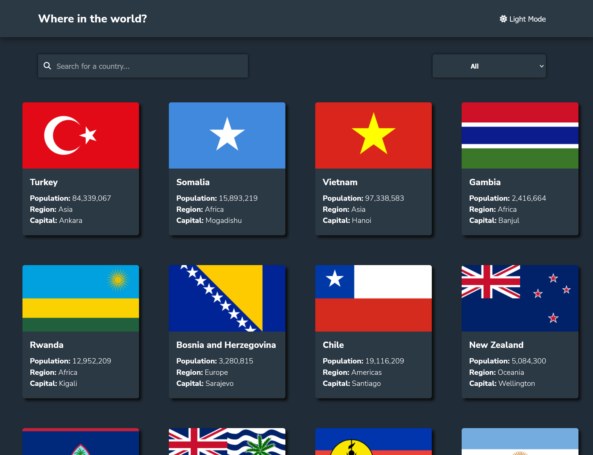
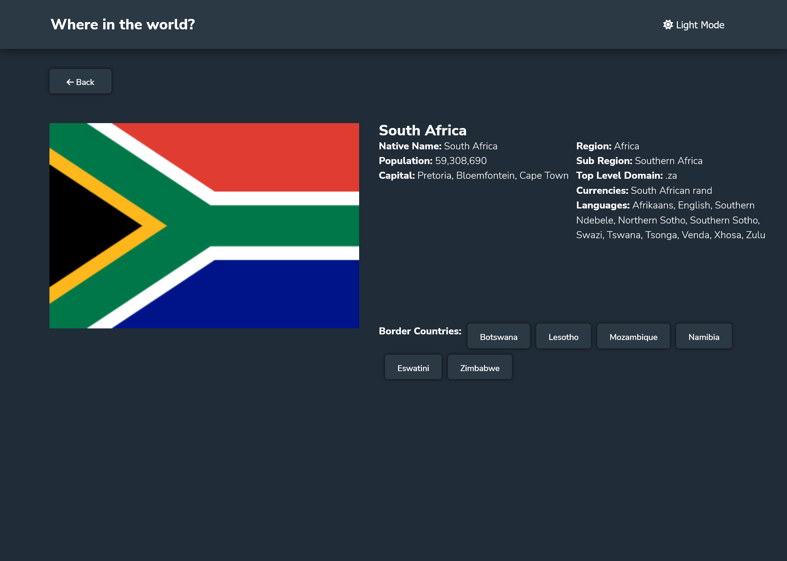

# REST Countries API FrontEnd with dark mode

## Table of contents

- [Overview](#overview)
  - [Screenshot](#screenshot)
  - [Links](#links)
- [My process](#my-process)
  - [Built with](#built-with)
  - [What I learned](#what-i-learned)
  - [Continued development](#continued-development)
- [Author](#author)

## Overview

A front end for a rest countries API, using React Context API to manage state and React Router to handle routing, created with typescript, react, sass. Responsive design for mobile, tablet and desktop.

### Features

- See all countries from the API on the homepage
- Search for a country using an `input` field
- Filter countries by region
- Click on a country to see more detailed information on a separate page
- Click through to the border countries on the detail page
- Toggle the color scheme between light and dark mode

- Responsible design adapted for mobile, tablet and desktop.
- Efficent use of the API to reduce the number of requests, one single request on load held in rect context and passed to components as needed. No lag on country pages and search.
- subtle on hover effects on cards.

### Screenshots

### Links

- Solution URL: [github.com/Scottburg/countries-api-react-context-pico](https://github.com/Scottburg/countries-api-react-context-pico)
- Live Site URL: [countrysearchapi.netlify.app](https://countrysearchapi.netlify.app/)

## My process

### Built with

- Mobile-first workflow
- [React](https://reactjs.org/) - JS library
- [Vue.js](https://vuejs.org/) - React framework
- [Styled Components](https://styled-components.com/) - For styles
- React Context API
- React Router
- Semantic HTML5 markup
- SASS
- Flexbox
- CSS Grid

### What I learned

- Understanding of the React Context API
- Implemention a dark mode, using Saas with a top level 'dark' class toggle to keep dark mode implementation clear and simple.

### Continued development

~~Adding animations on hover events.~~

## Author

- Website - [scottburgess.co.uk](https://www.scottburgess.co.uk)
- Frontend Mentor - [@scottburg](https://www.frontendmentor.io/profile/scottburg)
